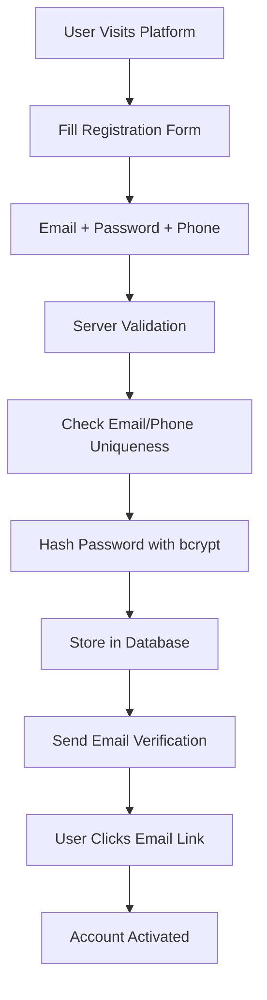
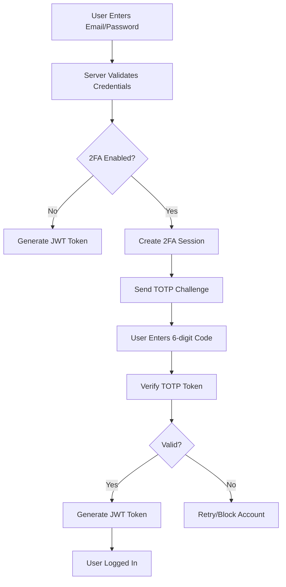
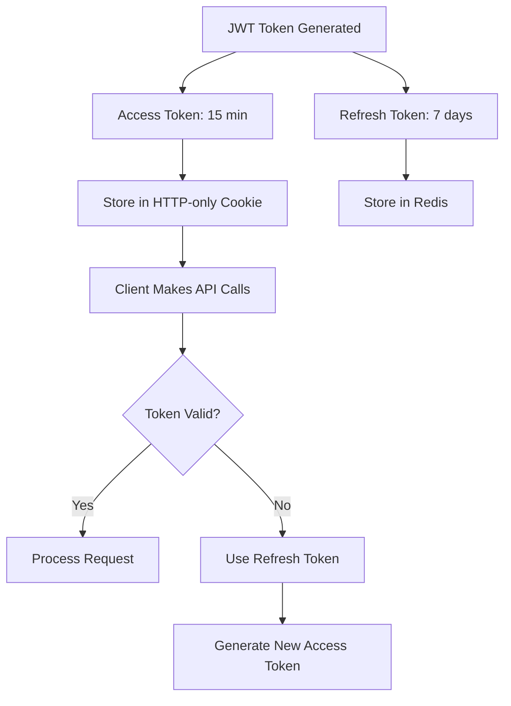
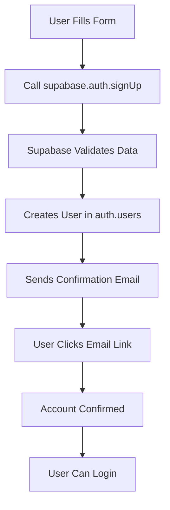
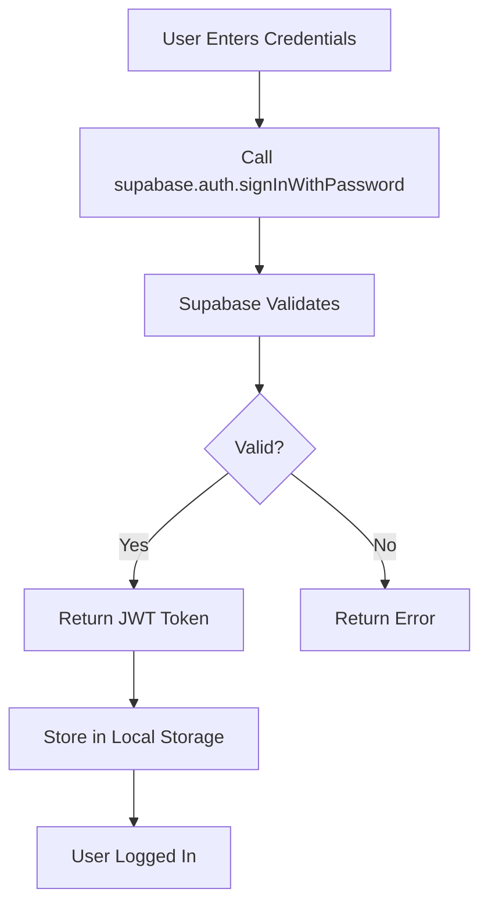

# 🔐 User Authentication System: Custom vs Managed Services

## 📋 **AUTHENTICATION OPTIONS COMPARISON**

---

## 🎯 **OPTION 1: CUSTOM AUTHENTICATION SYSTEM**

### **Step-by-Step User Authentication Flow**

#### **1. User Registration Process**


#### **2. Login Process with 2FA**


#### **3. Session Management**


### **Custom System Architecture**

```javascript
// Custom Authentication Service
class CustomAuthService {
    constructor() {
        this.jwtSecret = process.env.JWT_SECRET;
        this.refreshSecret = process.env.JWT_REFRESH_SECRET;
        this.redis = new Redis(process.env.REDIS_URL);
    }

    // Step 1: User Registration
    async registerUser(userData) {
        const { email, password, phone, name } = userData;
        
        // Validate input
        if (!this.validateEmail(email) || !this.validatePassword(password)) {
            throw new Error('Invalid input data');
        }
        
        // Check if user exists
        const existingUser = await User.findOne({ email });
        if (existingUser) {
            throw new Error('User already exists');
        }
        
        // Hash password
        const hashedPassword = await bcrypt.hash(password, 12);
        
        // Create user
        const user = await User.create({
            email,
            password: hashedPassword,
            phone,
            name,
            isEmailVerified: false,
            createdAt: new Date()
        });
        
        // Send verification email
        await this.sendVerificationEmail(user);
        
        return { success: true, userId: user.id };
    }

    // Step 2: Email Verification
    async verifyEmail(token) {
        try {
            const decoded = jwt.verify(token, this.jwtSecret);
            await User.updateOne(
                { _id: decoded.userId },
                { isEmailVerified: true }
            );
            return { success: true };
        } catch (error) {
            throw new Error('Invalid verification token');
        }
    }

    // Step 3: Login Process
    async login(email, password, ipAddress) {
        // Validate credentials
        const user = await User.findOne({ email });
        if (!user || !await bcrypt.compare(password, user.password)) {
            await this.logFailedAttempt(email, ipAddress);
            throw new Error('Invalid credentials');
        }

        // Check if account is locked
        if (await this.isAccountLocked(user.id)) {
            throw new Error('Account temporarily locked');
        }

        // Check if 2FA is enabled
        if (user.is2FAEnabled) {
            return await this.initiate2FA(user, ipAddress);
        }

        // Generate tokens for non-2FA users
        return await this.generateTokens(user);
    }

    // Step 4: 2FA Process
    async initiate2FA(user, ipAddress) {
        const sessionToken = crypto.randomBytes(32).toString('hex');
        const expiresAt = new Date(Date.now() + 10 * 60 * 1000); // 10 minutes
        
        await TwoFASession.create({
            userId: user.id,
            sessionToken,
            expiresAt,
            ipAddress
        });

        return {
            requires2FA: true,
            sessionToken,
            message: 'Please provide 2FA verification'
        };
    }

    // Step 5: Verify 2FA and Complete Login
    async verify2FA(sessionToken, totpCode) {
        const session = await TwoFASession.findOne({
            sessionToken,
            expiresAt: { $gt: new Date() },
            isVerified: false
        });

        if (!session) {
            throw new Error('Invalid or expired session');
        }

        const user = await User.findById(session.userId);
        const isValid = speakeasy.totp.verify({
            secret: user.totpSecret,
            encoding: 'base32',
            token: totpCode,
            window: 2
        });

        if (!isValid) {
            throw new Error('Invalid 2FA code');
        }

        // Mark session as verified
        await TwoFASession.updateOne(
            { _id: session._id },
            { isVerified: true }
        );

        return await this.generateTokens(user);
    }

    // Step 6: Generate JWT Tokens
    async generateTokens(user) {
        const accessToken = jwt.sign(
            { 
                userId: user.id, 
                email: user.email,
                role: user.role,
                is2FAVerified: true
            },
            this.jwtSecret,
            { expiresIn: '15m' }
        );

        const refreshToken = jwt.sign(
            { userId: user.id, tokenVersion: user.tokenVersion },
            this.refreshSecret,
            { expiresIn: '7d' }
        );

        // Store refresh token in Redis
        await this.redis.setex(
            `refresh_token:${user.id}`,
            7 * 24 * 60 * 60, // 7 days
            refreshToken
        );

        return {
            success: true,
            accessToken,
            refreshToken,
            user: {
                id: user.id,
                email: user.email,
                name: user.name,
                role: user.role
            }
        };
    }

    // Step 7: Token Refresh
    async refreshAccessToken(refreshToken) {
        try {
            const decoded = jwt.verify(refreshToken, this.refreshSecret);
            const storedToken = await this.redis.get(`refresh_token:${decoded.userId}`);
            
            if (storedToken !== refreshToken) {
                throw new Error('Invalid refresh token');
            }

            const user = await User.findById(decoded.userId);
            if (!user || user.tokenVersion !== decoded.tokenVersion) {
                throw new Error('Invalid token version');
            }

            // Generate new access token
            const newAccessToken = jwt.sign(
                { 
                    userId: user.id, 
                    email: user.email,
                    role: user.role,
                    is2FAVerified: true
                },
                this.jwtSecret,
                { expiresIn: '15m' }
            );

            return { accessToken: newAccessToken };
        } catch (error) {
            throw new Error('Token refresh failed');
        }
    }

    // Step 8: Logout
    async logout(userId, refreshToken) {
        // Remove refresh token from Redis
        await this.redis.del(`refresh_token:${userId}`);
        
        // Optionally blacklist access token
        // await this.blacklistToken(accessToken);
        
        return { success: true };
    }
}
```

### **Custom System Pros & Cons**

#### **✅ Advantages:**
- **Full Control**: Complete control over authentication logic
- **Customization**: Tailored to specific business requirements
- **Cost Effective**: No per-user pricing, only infrastructure costs
- **Data Ownership**: All user data stays in your database
- **Compliance**: Easier to meet specific regulatory requirements
- **Integration**: Seamless integration with existing systems

#### **❌ Disadvantages:**
- **Development Time**: 4-6 weeks of development effort
- **Security Responsibility**: You handle all security aspects
- **Maintenance**: Ongoing updates and security patches
- **Scaling Complexity**: Need to handle scaling yourself
- **Feature Development**: Build all features from scratch

---

## 🎯 **OPTION 2: SUPABASE AUTHENTICATION**

### **Step-by-Step Supabase Authentication Flow**

#### **1. Supabase Setup and Configuration**
```javascript
// Supabase Client Setup
import { createClient } from '@supabase/supabase-js'

const supabaseUrl = 'https://your-project.supabase.co'
const supabaseKey = 'your-anon-key'
const supabase = createClient(supabaseUrl, supabaseKey)

// Configure authentication settings
const authConfig = {
    site_url: 'https://your-app.com',
    redirect_urls: ['https://your-app.com/auth/callback'],
    jwt_expiry: 3600, // 1 hour
    refresh_token_rotation_enabled: true,
    security_update_password_require_reauthentication: true
}
```

#### **2. User Registration Process**


```javascript
// User Registration with Supabase
async function registerUser(email, password, userData) {
    try {
        const { data, error } = await supabase.auth.signUp({
            email: email,
            password: password,
            options: {
                data: {
                    name: userData.name,
                    phone: userData.phone,
                    // Additional metadata
                }
            }
        });

        if (error) throw error;

        // Create profile in public.profiles table
        const { error: profileError } = await supabase
            .from('profiles')
            .insert([
                {
                    id: data.user.id,
                    name: userData.name,
                    phone: userData.phone,
                    created_at: new Date()
                }
            ]);

        if (profileError) throw profileError;

        return { success: true, user: data.user };
    } catch (error) {
        console.error('Registration error:', error);
        throw error;
    }
}
```

#### **3. Login Process**


```javascript
// Login with Supabase
async function loginUser(email, password) {
    try {
        const { data, error } = await supabase.auth.signInWithPassword({
            email: email,
            password: password,
        });

        if (error) throw error;

        // Supabase automatically handles JWT tokens
        return {
            success: true,
            user: data.user,
            session: data.session
        };
    } catch (error) {
        console.error('Login error:', error);
        throw error;
    }
}
```

#### **4. 2FA Implementation with Supabase**
```javascript
// Enable 2FA for user
async function enable2FA() {
    try {
        const { data, error } = await supabase.auth.mfa.enroll({
            factorType: 'totp'
        });

        if (error) throw error;

        return {
            qrCode: data.qr_code,
            secret: data.secret,
            factorId: data.id
        };
    } catch (error) {
        console.error('2FA enrollment error:', error);
        throw error;
    }
}

// Verify 2FA during login
async function verify2FA(factorId, code) {
    try {
        const { data, error } = await supabase.auth.mfa.verify({
            factorId: factorId,
            challengeId: challengeId,
            code: code
        });

        if (error) throw error;

        return { success: true, session: data.session };
    } catch (error) {
        console.error('2FA verification error:', error);
        throw error;
    }
}
```

#### **5. Session Management**
```javascript
// Automatic session management
supabase.auth.onAuthStateChange((event, session) => {
    if (event === 'SIGNED_IN') {
        console.log('User signed in:', session.user);
        // Update UI, redirect, etc.
    } else if (event === 'SIGNED_OUT') {
        console.log('User signed out');
        // Clear user data, redirect to login
    } else if (event === 'TOKEN_REFRESHED') {
        console.log('Token refreshed:', session);
        // Token automatically refreshed
    }
});

// Manual session check
async function getCurrentUser() {
    const { data: { user } } = await supabase.auth.getUser();
    return user;
}

// Logout
async function logout() {
    const { error } = await supabase.auth.signOut();
    if (error) console.error('Logout error:', error);
}
```

### **Supabase Integration Architecture**

```javascript
// Complete Supabase Auth Service
class SupabaseAuthService {
    constructor() {
        this.supabase = createClient(
            process.env.SUPABASE_URL,
            process.env.SUPABASE_ANON_KEY
        );
    }

    // User Registration
    async register(userData) {
        const { email, password, name, phone } = userData;
        
        const { data, error } = await this.supabase.auth.signUp({
            email,
            password,
            options: {
                data: { name, phone }
            }
        });

        if (error) throw error;

        // Create user profile
        await this.createUserProfile(data.user.id, { name, phone });
        
        return data;
    }

    // User Login
    async login(email, password) {
        const { data, error } = await this.supabase.auth.signInWithPassword({
            email,
            password
        });

        if (error) throw error;
        return data;
    }

    // Social Login
    async loginWithProvider(provider) {
        const { data, error } = await this.supabase.auth.signInWithOAuth({
            provider: provider, // 'google', 'github', etc.
            options: {
                redirectTo: `${window.location.origin}/auth/callback`
            }
        });

        if (error) throw error;
        return data;
    }

    // Password Reset
    async resetPassword(email) {
        const { error } = await this.supabase.auth.resetPasswordForEmail(email, {
            redirectTo: `${window.location.origin}/auth/reset-password`
        });

        if (error) throw error;
        return { success: true };
    }

    // Update Password
    async updatePassword(newPassword) {
        const { error } = await this.supabase.auth.updateUser({
            password: newPassword
        });

        if (error) throw error;
        return { success: true };
    }

    // Get Current User
    async getCurrentUser() {
        const { data: { user } } = await this.supabase.auth.getUser();
        return user;
    }

    // Create User Profile
    async createUserProfile(userId, profileData) {
        const { error } = await this.supabase
            .from('profiles')
            .insert([
                {
                    id: userId,
                    ...profileData,
                    created_at: new Date()
                }
            ]);

        if (error) throw error;
    }

    // Logout
    async logout() {
        const { error } = await this.supabase.auth.signOut();
        if (error) throw error;
    }
}
```

### **Supabase Pros & Cons**

#### **✅ Advantages:**
- **Quick Setup**: Authentication ready in hours, not weeks
- **Built-in Features**: 2FA, social login, password reset out of the box
- **Security**: Enterprise-grade security handled by Supabase
- **Scaling**: Automatic scaling and performance optimization
- **Real-time**: Built-in real-time subscriptions
- **Database**: PostgreSQL database included
- **Dashboard**: Admin dashboard for user management

#### **❌ Disadvantages:**
- **Vendor Lock-in**: Dependent on Supabase service
- **Cost**: Per-user pricing can get expensive at scale
- **Limited Customization**: Less flexibility for custom requirements
- **Data Location**: Data stored on Supabase servers
- **Compliance**: May not meet specific regulatory requirements
- **Migration**: Difficult to migrate away from Supabase later

---

## 🎯 **OPTION 3: HYBRID APPROACH**

### **Custom Authentication + Supabase Database**

```javascript
// Hybrid approach using custom auth logic with Supabase as database
class HybridAuthService {
    constructor() {
        this.supabase = createClient(
            process.env.SUPABASE_URL,
            process.env.SUPABASE_SERVICE_KEY // Service key for admin operations
        );
        this.jwtSecret = process.env.JWT_SECRET;
    }

    // Custom registration with Supabase storage
    async register(userData) {
        const { email, password, name, phone } = userData;
        
        // Custom validation
        if (!this.validateInput(userData)) {
            throw new Error('Invalid input');
        }

        // Hash password with custom logic
        const hashedPassword = await bcrypt.hash(password, 12);

        // Store in Supabase database
        const { data, error } = await this.supabase
            .from('users')
            .insert([
                {
                    email,
                    password_hash: hashedPassword,
                    name,
                    phone,
                    is_email_verified: false,
                    created_at: new Date()
                }
            ])
            .select()
            .single();

        if (error) throw error;

        // Send custom verification email
        await this.sendCustomVerificationEmail(data);
        
        return data;
    }

    // Custom login with JWT generation
    async login(email, password) {
        // Fetch user from Supabase
        const { data: user, error } = await this.supabase
            .from('users')
            .select('*')
            .eq('email', email)
            .single();

        if (error || !user) {
            throw new Error('User not found');
        }

        // Custom password verification
        const isValid = await bcrypt.compare(password, user.password_hash);
        if (!isValid) {
            throw new Error('Invalid password');
        }

        // Generate custom JWT
        const token = jwt.sign(
            { userId: user.id, email: user.email },
            this.jwtSecret,
            { expiresIn: '1h' }
        );

        return { user, token };
    }
}
```

---

## 📊 **COMPARISON MATRIX**

| Feature | Custom System | Supabase | Hybrid |
|---------|---------------|----------|--------|
| **Development Time** | 4-6 weeks | 1-2 days | 2-3 weeks |
| **Initial Cost** | Low | Medium | Medium |
| **Scaling Cost** | Infrastructure only | Per-user pricing | Infrastructure + DB |
| **Customization** | Full control | Limited | Moderate |
| **Security Responsibility** | You handle | Supabase handles | Shared |
| **Compliance Control** | Full control | Limited | Moderate |
| **Maintenance** | High | Low | Medium |
| **Vendor Lock-in** | None | High | Low |
| **2FA Implementation** | Custom code | Built-in | Custom code |
| **Social Login** | Custom integration | Built-in | Custom integration |
| **Real-time Features** | Custom WebSocket | Built-in | Custom WebSocket |

---

## 🎯 **RECOMMENDATION FOR SIP BREWERY**

### **For Financial Platform: CUSTOM AUTHENTICATION SYSTEM**

#### **Why Custom is Better for Financial Platforms:**

1. **Regulatory Compliance**: 
   - Full control over data storage and processing
   - Easier to meet SEBI, RBI compliance requirements
   - Complete audit trail ownership

2. **Security Control**:
   - Custom security measures for financial data
   - Integration with BSE STAR MF authentication
   - Custom fraud detection and monitoring

3. **Cost Efficiency**:
   - No per-user pricing at scale
   - Lower long-term operational costs
   - Better ROI for large user base

4. **Integration Flexibility**:
   - Seamless integration with BSE STAR MF
   - Custom KYC workflow integration
   - Flexible user role management

5. **Data Ownership**:
   - Complete control over user data
   - No third-party data sharing concerns
   - Easier data migration and backup

### **Recommended Architecture:**

```javascript
// Recommended Custom Auth Stack
const authStack = {
    // Core Components
    authentication: 'Custom JWT + 2FA',
    database: 'PostgreSQL',
    caching: 'Redis',
    encryption: 'bcrypt + AES-256',
    
    // Security Features
    twoFactor: 'TOTP (Google Authenticator)',
    rateLimiting: 'express-rate-limit',
    sessionManagement: 'JWT + Refresh Tokens',
    
    // Integration
    bseIntegration: 'Direct API integration',
    kycIntegration: 'CVL KRA / CAMS KRA',
    
    // Monitoring
    logging: 'Winston + ELK Stack',
    monitoring: 'Sentry + New Relic'
};
```

### **Implementation Timeline:**
- **Week 1-2**: Database schema and basic auth
- **Week 3-4**: 2FA implementation and testing
- **Week 5-6**: Security hardening and compliance
- **Total**: 6 weeks for production-ready system

This custom approach gives you the control, security, and compliance capabilities needed for a financial platform while maintaining cost efficiency and integration flexibility with BSE STAR MF and other financial services.

Would you like me to start implementing the custom authentication system with the detailed code structure?
