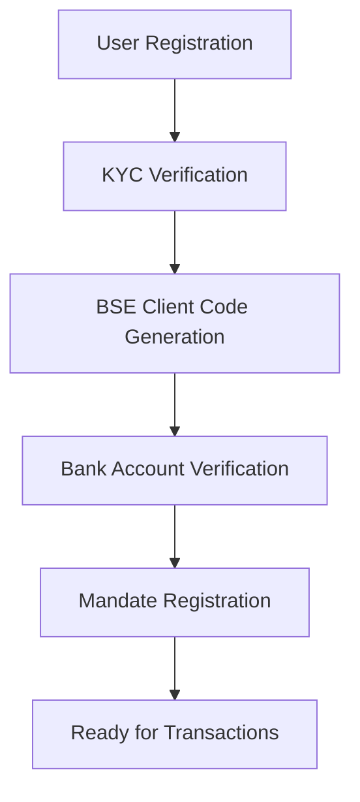
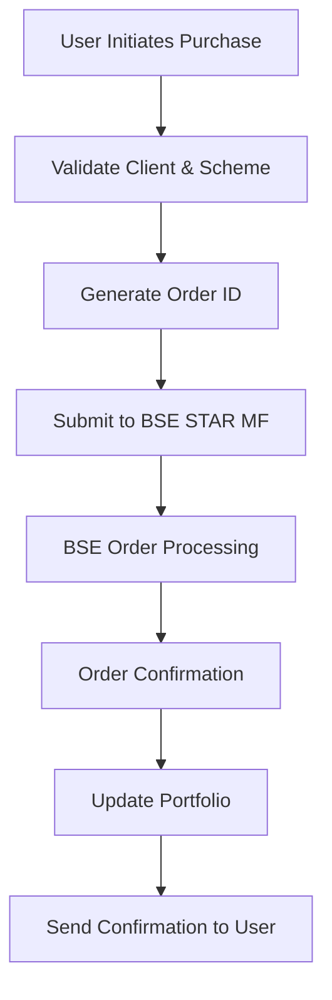
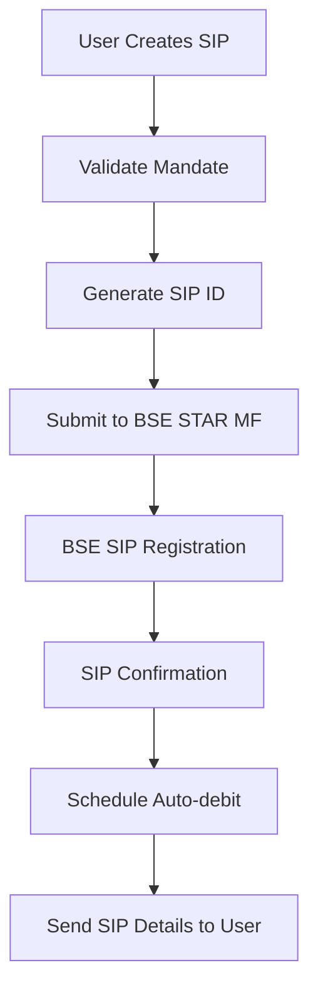

# 🏛️ BSE STAR MF Integration Guide

## 📋 **BSE STAR MF PLATFORM OVERVIEW**

**BSE StAR Mutual Fund** is the official platform by Bombay Stock Exchange for mutual fund distribution in India. It provides direct connectivity to all AMFI-registered Asset Management Companies (AMCs) and ensures SEBI-compliant transactions.

---

## 🎯 **WHY BSE STAR MF?**

### **Regulatory Advantages**:
- **SEBI Approved**: Official SEBI-approved platform for MF transactions
- **Direct AMC Connectivity**: No intermediary payment gateways needed
- **Compliance Built-in**: Automatic regulatory compliance
- **Audit Trail**: Complete transaction audit logs for regulators

### **Business Benefits**:
- **Lower Transaction Costs**: 0.25-0.50% vs 2-3% payment gateway fees
- **Faster Settlement**: T+1 settlement cycle
- **Real-time Processing**: Instant order confirmation
- **Comprehensive Coverage**: All 44+ AMCs and 3000+ schemes

### **Technical Advantages**:
- **Standardized APIs**: Consistent interface across all AMCs
- **Real-time NAV**: Live NAV updates for accurate pricing
- **SIP Automation**: Built-in SIP processing with NACH integration
- **Consolidated Reporting**: Single platform for all transactions

---

## 🔧 **BSE STAR MF MEMBERSHIP REQUIREMENTS**

### **1. Membership Categories**

#### **Trading Member (TM)**
- **Cost**: ₹2,00,000 annual membership fee
- **Features**: Full trading rights, direct market access
- **Best For**: Large-scale operations (>₹100 crore AUM)

#### **Authorized Person (AP)**
- **Cost**: ₹50,000 - ₹1,00,000 annual fee
- **Features**: Limited trading rights under a TM
- **Best For**: Startups and medium-scale operations

#### **Technology Partner**
- **Cost**: ₹25,000 - ₹50,000 setup fee
- **Features**: API access through existing TM
- **Best For**: Tech companies building platforms

### **2. Eligibility Criteria**

```markdown
**For Trading Member (TM)**:
- SEBI registration as mutual fund distributor
- Minimum net worth: ₹50 lakhs
- Professional indemnity insurance: ₹1 crore
- Compliance officer certification
- Office infrastructure requirements

**For Authorized Person (AP)**:
- SEBI registration as mutual fund distributor
- Minimum net worth: ₹10 lakhs
- Professional indemnity insurance: ₹25 lakhs
- NISM certification (Series V-A)
- Sponsorship by existing TM
```

### **3. Documentation Required**

```markdown
**Legal Documents**:
- Certificate of Incorporation
- SEBI registration certificate
- PAN and TAN certificates
- GST registration certificate
- Professional indemnity insurance policy

**Financial Documents**:
- Audited financial statements (last 3 years)
- Net worth certificate from CA
- Bank statements and solvency certificate
- Income tax returns

**Technical Documents**:
- IT infrastructure details
- Data security compliance certificate
- Disaster recovery plan
- Business continuity plan
```

---

## 🛠️ **TECHNICAL INTEGRATION**

### **1. BSE STAR MF API Architecture**

```javascript
// BSE STAR MF API Configuration
const BSE_CONFIG = {
    // Production Environment
    PROD_URL: 'https://bsestarmf.in/StarMFWebService/StarMFWebService.svc',
    
    // UAT Environment  
    UAT_URL: 'https://bsestarmfuat.bseindia.com/StarMFWebService/StarMFWebService.svc',
    
    // API Endpoints
    ENDPOINTS: {
        ORDER_ENTRY: '/OrderEntry',
        ORDER_STATUS: '/OrderStatus', 
        SIP_REGISTRATION: '/SIPRegistration',
        FOLIO_DETAILS: '/FolioDetails',
        NAV_DETAILS: '/NAVDetails',
        SCHEME_DETAILS: '/SchemeDetails',
        MANDATE_REGISTRATION: '/MandateRegistration'
    },
    
    // Authentication
    AUTH: {
        USER_ID: process.env.BSE_USER_ID,
        PASSWORD: process.env.BSE_PASSWORD,
        MEMBER_ID: process.env.BSE_MEMBER_ID,
        PASSKEY: process.env.BSE_PASSKEY
    }
};
```

### **2. Core Integration Service**

```javascript
// services/BSEStarMFService.js
const axios = require('axios');
const xml2js = require('xml2js');
const crypto = require('crypto');
const moment = require('moment');

class BSEStarMFService {
    constructor() {
        this.baseURL = process.env.NODE_ENV === 'production' 
            ? BSE_CONFIG.PROD_URL 
            : BSE_CONFIG.UAT_URL;
        this.parser = new xml2js.Parser();
        this.builder = new xml2js.Builder();
    }

    // Generate authentication checksum
    generateChecksum(data) {
        const concatenatedString = Object.values(data).join('|');
        return crypto
            .createHash('sha256')
            .update(concatenatedString + BSE_CONFIG.AUTH.PASSKEY)
            .digest('hex');
    }

    // Order Entry for Mutual Fund Purchase
    async placePurchaseOrder(orderData) {
        try {
            const requestData = {
                TransCode: '01', // Purchase
                TransNo: this.generateTransactionNumber(),
                OrderId: orderData.orderId,
                UserId: BSE_CONFIG.AUTH.USER_ID,
                MemberId: BSE_CONFIG.AUTH.MEMBER_ID,
                ClientCode: orderData.clientCode,
                SchemeCode: orderData.schemeCode,
                BuySell: 'P', // Purchase
                BuySellType: 'FRESH', // Fresh purchase
                DPTxn: 'P', // Physical
                OrderVal: orderData.amount,
                Qty: orderData.quantity || '',
                AllRedeem: 'N',
                FolioNo: orderData.folioNumber || '',
                Remarks: orderData.remarks || '',
                KYCStatus: 'Y',
                RefNo: orderData.referenceNumber || '',
                SubBrCode: orderData.subBrokerCode || '',
                EUIN: orderData.euin || '',
                EUINVal: orderData.euinValidation || 'N',
                MinRedeem: 'N',
                DPC: 'Y',
                IPAddress: orderData.ipAddress,
                Password: BSE_CONFIG.AUTH.PASSWORD,
                PassKey: BSE_CONFIG.AUTH.PASSKEY,
                Param1: orderData.param1 || '',
                Param2: orderData.param2 || '',
                Param3: orderData.param3 || ''
            };

            // Generate checksum
            requestData.Checksum = this.generateChecksum(requestData);

            const response = await axios.post(
                `${this.baseURL}${BSE_CONFIG.ENDPOINTS.ORDER_ENTRY}`,
                this.builder.buildObject({ OrderEntryParam: requestData }),
                {
                    headers: {
                        'Content-Type': 'application/soap+xml; charset=utf-8',
                        'SOAPAction': 'http://bsestarmf.in/2016/01/IStarMFWebService/OrderEntry'
                    }
                }
            );

            const result = await this.parser.parseStringPromise(response.data);
            return this.parseOrderResponse(result);

        } catch (error) {
            console.error('BSE Order Entry Error:', error);
            throw new Error('Failed to place order with BSE STAR MF');
        }
    }

    // SIP Registration
    async registerSIP(sipData) {
        try {
            const requestData = {
                TransactionCode: '01',
                UniqueRefNo: sipData.uniqueRefNo,
                SchemeCode: sipData.schemeCode,
                MemberCode: BSE_CONFIG.AUTH.MEMBER_ID,
                ClientCode: sipData.clientCode,
                UserID: BSE_CONFIG.AUTH.USER_ID,
                InternalRefNo: sipData.internalRefNo,
                TransMode: 'P', // Physical
                DPTxnMode: 'P',
                StartDate: moment(sipData.startDate).format('DD/MM/YYYY'),
                FrequencyType: sipData.frequency, // M=Monthly, Q=Quarterly
                FrequencyAllowed: sipData.frequencyAllowed || '1',
                InstallmentAmount: sipData.amount,
                NoOfInstallment: sipData.installments,
                Remarks: sipData.remarks || '',
                FolioNo: sipData.folioNumber || '',
                FirstOrderFlag: 'Y',
                Brokerage: sipData.brokerage || '0',
                MandateID: sipData.mandateId,
                SubBrCode: sipData.subBrokerCode || '',
                EUIN: sipData.euin || '',
                EUINVal: sipData.euinValidation || 'N',
                DPC: 'Y',
                Password: BSE_CONFIG.AUTH.PASSWORD,
                PassKey: BSE_CONFIG.AUTH.PASSKEY,
                Param1: sipData.param1 || '',
                Param2: sipData.param2 || '',
                Param3: sipData.param3 || ''
            };

            requestData.Checksum = this.generateChecksum(requestData);

            const response = await axios.post(
                `${this.baseURL}${BSE_CONFIG.ENDPOINTS.SIP_REGISTRATION}`,
                this.builder.buildObject({ SIPOrderEntryParam: requestData }),
                {
                    headers: {
                        'Content-Type': 'application/soap+xml; charset=utf-8',
                        'SOAPAction': 'http://bsestarmf.in/2016/01/IStarMFWebService/SIPOrderEntry'
                    }
                }
            );

            const result = await this.parser.parseStringPromise(response.data);
            return this.parseSIPResponse(result);

        } catch (error) {
            console.error('BSE SIP Registration Error:', error);
            throw new Error('Failed to register SIP with BSE STAR MF');
        }
    }

    // Get Order Status
    async getOrderStatus(clientCode, orderNumber) {
        try {
            const requestData = {
                MemberCode: BSE_CONFIG.AUTH.MEMBER_ID,
                ClientCode: clientCode,
                OrderNo: orderNumber,
                UserId: BSE_CONFIG.AUTH.USER_ID,
                Password: BSE_CONFIG.AUTH.PASSWORD,
                PassKey: BSE_CONFIG.AUTH.PASSKEY
            };

            requestData.Checksum = this.generateChecksum(requestData);

            const response = await axios.post(
                `${this.baseURL}${BSE_CONFIG.ENDPOINTS.ORDER_STATUS}`,
                this.builder.buildObject({ OrderStatusParam: requestData }),
                {
                    headers: {
                        'Content-Type': 'application/soap+xml; charset=utf-8',
                        'SOAPAction': 'http://bsestarmf.in/2016/01/IStarMFWebService/OrderStatus'
                    }
                }
            );

            const result = await this.parser.parseStringPromise(response.data);
            return this.parseStatusResponse(result);

        } catch (error) {
            console.error('BSE Order Status Error:', error);
            throw new Error('Failed to get order status from BSE STAR MF');
        }
    }

    // Get Scheme Details
    async getSchemeDetails(schemeCode = '') {
        try {
            const requestData = {
                MemberCode: BSE_CONFIG.AUTH.MEMBER_ID,
                UserId: BSE_CONFIG.AUTH.USER_ID,
                SchemeCode: schemeCode,
                Password: BSE_CONFIG.AUTH.PASSWORD,
                PassKey: BSE_CONFIG.AUTH.PASSKEY
            };

            requestData.Checksum = this.generateChecksum(requestData);

            const response = await axios.post(
                `${this.baseURL}${BSE_CONFIG.ENDPOINTS.SCHEME_DETAILS}`,
                this.builder.buildObject({ SchemeDetailsParam: requestData }),
                {
                    headers: {
                        'Content-Type': 'application/soap+xml; charset=utf-8',
                        'SOAPAction': 'http://bsestarmf.in/2016/01/IStarMFWebService/SchemeDetails'
                    }
                }
            );

            const result = await this.parser.parseStringPromise(response.data);
            return this.parseSchemeResponse(result);

        } catch (error) {
            console.error('BSE Scheme Details Error:', error);
            throw new Error('Failed to get scheme details from BSE STAR MF');
        }
    }

    // Helper Methods
    generateTransactionNumber() {
        return `TXN${Date.now()}${Math.floor(Math.random() * 1000)}`;
    }

    parseOrderResponse(xmlResult) {
        // Parse XML response and extract order details
        const orderResult = xmlResult?.OrderEntryResponse?.OrderEntryResult?.[0];
        return {
            success: orderResult?.Status === 'Success',
            orderNumber: orderResult?.OrderNumber,
            message: orderResult?.Message,
            errorCode: orderResult?.ErrorCode,
            timestamp: new Date().toISOString()
        };
    }

    parseSIPResponse(xmlResult) {
        // Parse XML response and extract SIP details
        const sipResult = xmlResult?.SIPOrderEntryResponse?.SIPOrderEntryResult?.[0];
        return {
            success: sipResult?.Status === 'Success',
            sipRegNumber: sipResult?.SIPRegNumber,
            message: sipResult?.Message,
            errorCode: sipResult?.ErrorCode,
            timestamp: new Date().toISOString()
        };
    }

    parseStatusResponse(xmlResult) {
        // Parse XML response and extract status details
        const statusResult = xmlResult?.OrderStatusResponse?.OrderStatusResult?.[0];
        return {
            orderNumber: statusResult?.OrderNumber,
            status: statusResult?.Status,
            amount: statusResult?.Amount,
            units: statusResult?.Units,
            nav: statusResult?.NAV,
            settlementDate: statusResult?.SettlementDate,
            timestamp: new Date().toISOString()
        };
    }

    parseSchemeResponse(xmlResult) {
        // Parse XML response and extract scheme details
        const schemes = xmlResult?.SchemeDetailsResponse?.SchemeDetailsResult?.[0]?.Schemes;
        return schemes?.map(scheme => ({
            schemeCode: scheme.SchemeCode,
            schemeName: scheme.SchemeName,
            amcCode: scheme.AMCCode,
            amcName: scheme.AMCName,
            schemeType: scheme.SchemeType,
            nav: scheme.NAV,
            navDate: scheme.NAVDate,
            minAmount: scheme.MinAmount,
            maxAmount: scheme.MaxAmount,
            purchaseAllowed: scheme.PurchaseAllowed === 'Y',
            redemptionAllowed: scheme.RedemptionAllowed === 'Y',
            sipAllowed: scheme.SIPAllowed === 'Y'
        })) || [];
    }
}

module.exports = new BSEStarMFService();
```

### **3. Database Schema for BSE Integration**

```sql
-- BSE STAR MF specific tables

-- Client registration with BSE
CREATE TABLE bse_clients (
    id UUID PRIMARY KEY DEFAULT gen_random_uuid(),
    user_id UUID REFERENCES users(id),
    client_code VARCHAR(20) UNIQUE NOT NULL,
    pan VARCHAR(10) NOT NULL,
    kyc_status VARCHAR(10) DEFAULT 'PENDING',
    folio_number VARCHAR(20),
    bank_account VARCHAR(20),
    ifsc_code VARCHAR(11),
    registered_at TIMESTAMP DEFAULT NOW(),
    updated_at TIMESTAMP DEFAULT NOW()
);

-- BSE order tracking
CREATE TABLE bse_orders (
    id UUID PRIMARY KEY DEFAULT gen_random_uuid(),
    user_id UUID REFERENCES users(id),
    client_code VARCHAR(20) REFERENCES bse_clients(client_code),
    order_id VARCHAR(50) UNIQUE NOT NULL,
    bse_order_number VARCHAR(50),
    transaction_type VARCHAR(10), -- PURCHASE, REDEMPTION, SWITCH
    scheme_code VARCHAR(20) NOT NULL,
    scheme_name VARCHAR(255),
    amount DECIMAL(15,2),
    units DECIMAL(15,4),
    nav DECIMAL(10,4),
    order_status VARCHAR(20) DEFAULT 'PENDING',
    settlement_date DATE,
    folio_number VARCHAR(20),
    transaction_charge DECIMAL(10,2) DEFAULT 0,
    bse_response TEXT, -- Store full BSE response
    created_at TIMESTAMP DEFAULT NOW(),
    updated_at TIMESTAMP DEFAULT NOW()
);

-- SIP registration with BSE
CREATE TABLE bse_sips (
    id UUID PRIMARY KEY DEFAULT gen_random_uuid(),
    user_id UUID REFERENCES users(id),
    client_code VARCHAR(20) REFERENCES bse_clients(client_code),
    sip_id VARCHAR(50) UNIQUE NOT NULL,
    bse_sip_reg_number VARCHAR(50),
    scheme_code VARCHAR(20) NOT NULL,
    scheme_name VARCHAR(255),
    amount DECIMAL(15,2) NOT NULL,
    frequency VARCHAR(10) NOT NULL, -- MONTHLY, QUARTERLY
    start_date DATE NOT NULL,
    end_date DATE,
    installments INTEGER,
    mandate_id VARCHAR(50),
    sip_status VARCHAR(20) DEFAULT 'ACTIVE',
    folio_number VARCHAR(20),
    created_at TIMESTAMP DEFAULT NOW(),
    updated_at TIMESTAMP DEFAULT NOW()
);

-- BSE mandate registration for SIP auto-debit
CREATE TABLE bse_mandates (
    id UUID PRIMARY KEY DEFAULT gen_random_uuid(),
    user_id UUID REFERENCES users(id),
    client_code VARCHAR(20) REFERENCES bse_clients(client_code),
    mandate_id VARCHAR(50) UNIQUE NOT NULL,
    bank_account VARCHAR(20) NOT NULL,
    ifsc_code VARCHAR(11) NOT NULL,
    max_amount DECIMAL(15,2) NOT NULL,
    mandate_status VARCHAR(20) DEFAULT 'PENDING',
    start_date DATE NOT NULL,
    end_date DATE NOT NULL,
    created_at TIMESTAMP DEFAULT NOW(),
    updated_at TIMESTAMP DEFAULT NOW()
);

-- BSE scheme master data
CREATE TABLE bse_schemes (
    scheme_code VARCHAR(20) PRIMARY KEY,
    scheme_name VARCHAR(255) NOT NULL,
    amc_code VARCHAR(10) NOT NULL,
    amc_name VARCHAR(100) NOT NULL,
    scheme_type VARCHAR(50),
    category VARCHAR(50),
    sub_category VARCHAR(50),
    current_nav DECIMAL(10,4),
    nav_date DATE,
    min_purchase_amount DECIMAL(15,2),
    max_purchase_amount DECIMAL(15,2),
    min_sip_amount DECIMAL(15,2),
    purchase_allowed BOOLEAN DEFAULT true,
    redemption_allowed BOOLEAN DEFAULT true,
    sip_allowed BOOLEAN DEFAULT true,
    switch_allowed BOOLEAN DEFAULT true,
    updated_at TIMESTAMP DEFAULT NOW()
);

-- BSE transaction charges
CREATE TABLE bse_charges (
    id UUID PRIMARY KEY DEFAULT gen_random_uuid(),
    order_id UUID REFERENCES bse_orders(id),
    charge_type VARCHAR(50), -- BROKERAGE, STT, STAMP_DUTY, GST
    charge_amount DECIMAL(10,2),
    charge_percentage DECIMAL(5,4),
    created_at TIMESTAMP DEFAULT NOW()
);
```

---

## 🔄 **INTEGRATION WORKFLOW**

### **1. Client Onboarding Process**



### **2. Purchase Order Flow**



### **3. SIP Registration Flow**



---

## 💰 **COST STRUCTURE**

### **BSE STAR MF Charges**:

#### **Membership Fees**:
- **Trading Member**: ₹2,00,000/year
- **Authorized Person**: ₹50,000-₹1,00,000/year
- **Technology Partner**: ₹25,000-₹50,000 setup

#### **Transaction Charges**:
- **Purchase Orders**: ₹10-25 per transaction
- **Redemption Orders**: ₹10-25 per transaction
- **SIP Registration**: ₹25-50 per SIP
- **Switch Orders**: ₹15-30 per transaction

#### **Additional Charges**:
- **Statement Generation**: ₹5-10 per statement
- **Folio Maintenance**: ₹100-200/year per folio
- **API Usage**: Based on volume (₹0.50-2 per API call)

### **Comparison with Payment Gateways**:

| Feature | BSE STAR MF | Payment Gateway |
|---------|-------------|-----------------|
| Transaction Fee | ₹10-25 per order | 2-3% of amount |
| For ₹10,000 investment | ₹25 | ₹200-300 |
| Annual Membership | ₹50,000-₹2,00,000 | None |
| Settlement Time | T+1 | T+2 to T+3 |
| Regulatory Compliance | Built-in | Additional effort |
| AMC Integration | Direct | Through aggregators |

---

## 🚀 **IMPLEMENTATION TIMELINE**

### **Phase 1: BSE Membership (4-6 weeks)**
- [ ] Apply for BSE STAR MF membership
- [ ] Complete documentation and compliance
- [ ] Set up infrastructure and security
- [ ] Obtain UAT access credentials

### **Phase 2: Technical Integration (6-8 weeks)**
- [ ] Develop BSE API integration service
- [ ] Implement order management system
- [ ] Build SIP registration workflow
- [ ] Create client onboarding process

### **Phase 3: Testing & Certification (4-6 weeks)**
- [ ] UAT testing with BSE
- [ ] End-to-end transaction testing
- [ ] Performance and load testing
- [ ] Security audit and certification

### **Phase 4: Production Deployment (2-3 weeks)**
- [ ] Production environment setup
- [ ] Go-live with BSE STAR MF
- [ ] Monitor initial transactions
- [ ] User training and documentation

**Total Timeline: 16-23 weeks (4-6 months)**

---

## 📋 **IMMEDIATE NEXT STEPS**

1. **Contact BSE STAR MF Team**:
   - Email: starmf@bseindia.com
   - Phone: +91-22-2272-1233/1234
   - Website: https://www.bsestarmf.in/

2. **Prepare Documentation**:
   - SEBI registration certificate
   - Company incorporation documents
   - Financial statements and net worth certificate
   - IT infrastructure and security compliance

3. **Choose Membership Type**:
   - Evaluate business volume projections
   - Decide between TM, AP, or Technology Partner
   - Calculate cost-benefit analysis

4. **Technical Preparation**:
   - Set up development environment
   - Install required dependencies
   - Design database schema
   - Plan API integration architecture

This BSE STAR MF integration will provide a robust, compliant, and cost-effective foundation for your mutual fund platform, eliminating the need for traditional payment gateways while ensuring regulatory compliance and direct AMC connectivity.
